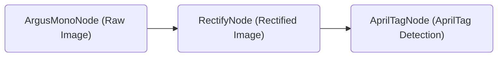
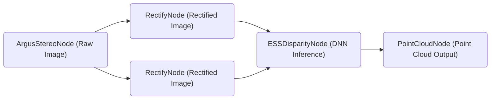
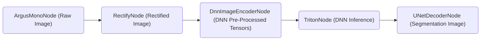

# Isaac ROS NITROS

<div align="center"></div>

## Overview

ROS 2 Humble introduces new hardware-acceleration features, including type adaptation and type negotiation, that significantly increase performance for developers seeking to incorporate AI/machine learning and computer vision functionality into their ROS-based applications.

Type adaptation (REP-2007) is common for hardware accelerators, which require a different data format to deliver optimal performance. Type adaptation allows ROS nodes to work in a format better suited to the hardware. Processing graphs can eliminate memory copies between the CPU and the memory accelerator using the adapted type. Unnecessary memory copies consume CPU compute, waste power, and slow down performance, especially as the image size increases.  

Type negotiation (REP-2009) allows different ROS nodes in a processing graph to advertise their supported types so that formats yielding ideal performance are chosen. The ROS framework performs this negotiation process and maintains compatibility with legacy nodes that don’t support negotiation.

Accelerating processing graphs using type adaptation and negotiation makes the hardware accelerator zero-copy possible. This reduces software/CPU overhead and unlocks the potential of the underlying hardware. As roboticists migrate to more powerful compute platforms like NVIDIA Jetson Orin, they can expect to realize more of the performance gains enabled by the hardware.

The NVIDIA implementation of type adaption and negotiation are called NITROS (NVIDIA Isaac Transport for ROS). ROS processing graphs made up of NITROS-based Isaac ROS hardware accelerated modules (a.k.a. GEMs or Isaac ROS nodes) can deliver promising performance and results.

## Table of Contents

- [Isaac ROS NITROS](#isaac-ros-nitros)
  - [Overview](#overview)
  - [Table of Contents](#table-of-contents)
  - [Latest Update](#latest-update)
  - [Supported Platforms](#supported-platforms)
    - [Docker](#docker)
  - [System Assumptions](#system-assumptions)
  - [NITROS-Accelerated Nodes](#nitros-accelerated-nodes)
  - [NITROS Data Types](#nitros-data-types)
  - [NITROS-Accelerated Graphs](#nitros-accelerated-graphs)
    - [AprilTag Detection Graph](#apriltag-detection-graph)
    - [Stereo Disparity Graph](#stereo-disparity-graph)
    - [Image Segmentation Graph](#image-segmentation-graph)
  - [Creating Graphs with NITROS-Accelerated Nodes](#creating-graphs-with-nitros-accelerated-nodes)
  - [Using NITROS-Accelerated Nodes in Existing Non-NITROS Graphs](#using-nitros-accelerated-nodes-in-existing-non-nitros-graphs)
  - [Updates](#updates)

## Latest Update

Update 2023-04-05: Update to be compatible with JetPack 5.1.1

## Supported Platforms

This package is designed and tested to be compatible with ROS 2 Humble running on [Jetson](https://developer.nvidia.com/embedded-computing) or an x86_64 system with an NVIDIA GPU.

> **Note**: Versions of ROS 2 earlier than Humble are **not** supported. This package depends on specific ROS 2 implementation features that were only introduced beginning with the Humble release.

| Platform | Hardware                                                                                                                                                                                                 | Software                                                                                                           | Notes                                                                                                                                                                                   |
| -------- | -------------------------------------------------------------------------------------------------------------------------------------------------------------------------------------------------------- | ------------------------------------------------------------------------------------------------------------------ | --------------------------------------------------------------------------------------------------------------------------------------------------------------------------------------- |
| Jetson   | [Jetson Orin](https://www.nvidia.com/en-us/autonomous-machines/embedded-systems/jetson-orin/) <br> [Jetson Xavier](https://www.nvidia.com/en-us/autonomous-machines/embedded-systems/jetson-agx-xavier/) | [JetPack 5.1.1](https://developer.nvidia.com/embedded/jetpack)                                                     | For best performance, ensure that [power settings](https://docs.nvidia.com/jetson/archives/r34.1/DeveloperGuide/text/SD/PlatformPowerAndPerformance.html) are configured appropriately. |
| x86_64   | NVIDIA GPU                                                                                                                                                                                               | [Ubuntu 20.04+](https://releases.ubuntu.com/20.04/) <br> [CUDA 11.8+](https://developer.nvidia.com/cuda-downloads) |

### Docker

To simplify development, we strongly recommend leveraging the Isaac ROS Dev Docker images by following [these steps](https://github.com/NVIDIA-ISAAC-ROS/isaac_ros_common/blob/main/docs/dev-env-setup.md). This will streamline your development environment setup with the correct versions of dependencies on both Jetson and x86_64 platforms.

> **Note:** All Isaac ROS Quickstarts, tutorials, and examples have been designed with the Isaac ROS Docker images as a prerequisite.

## System Assumptions

The design of NITROS makes the following assumptions of the ROS 2 applications:

- To leverage the benefit of zero-copy in NITROS, all NITROS-accelerated nodes must run in the same process.
- For a given topic in which type negotiation takes place, there can only be one negotiating publisher.
- For a NITROS-accelerated node, received-frame IDs are assumed to be constant throughout the runtime.

## NITROS-Accelerated Nodes

Most Isaac ROS GEMs have been updated to be NITROS-accelerated.
The acceleration is in effect between NITROS-accelerated nodes when two or more of them are connected next to each other. In such a case, NITROS-accelerated nodes can discover each other through type negotiation and leverage type adaptation for data transmission automatically at runtime.

NITROS-accelerated nodes are also compatible with non-NITROS nodes: A NITROS-accelerated node can be used together with any existing, non-NITROS ROS 2 node, and it will function like a typical ROS 2 node.

## NITROS Data Types

NITROS supports transporting various common data types with zero-copy in its own NITROS types.
Each NITROS type is one-to-one-mapped to a ROS message type, which ensures compatibility with existing tools, workflows, and codebases. A non-NITROS node supporting the corresponding ROS message types can publish data to or subscribe to data from a NITROS-accelerated node that supports the corresponding NITROS types.

| NITROS Interface             | ROS Interface                                                                                                                                                                       |
| ---------------------------- | ----------------------------------------------------------------------------------------------------------------------------------------------------------------------------------- |
| NitrosImage                  | [sensor_msgs/Image](https://github.com/ros2/common_interfaces/blob/humble/sensor_msgs/msg/Image.msg)                                                                                |
| NitrosCameraInfo             | [sensor_msgs/CameraInfo](https://github.com/ros2/common_interfaces/blob/humble/sensor_msgs/msg/CameraInfo.msg)                                                                      |
| NitrosTensorList             | [isaac_ros_tensor_list_interfaces/TensorList](https://github.com/NVIDIA-ISAAC-ROS/isaac_ros_common/blob/main/isaac_ros_tensor_list_interfaces/msg/TensorList.msg)                   |
| NitrosDisparityImage         | [stereo_msgs/DisparityImage](https://github.com/ros2/common_interfaces/blob/humble/stereo_msgs/msg/DisparityImage.msg)                                                              |
| NitrosPointCloud             | [sensor_msgs/PointCloud2](https://github.com/ros2/common_interfaces/blob/humble/sensor_msgs/msg/PointCloud2.msg)                                                                    |
| NitrosAprilTagDetectionArray | [isaac_ros_apriltag_interfaces/AprilTagDetectionArray](https://github.com/NVIDIA-ISAAC-ROS/isaac_ros_common/blob/main/isaac_ros_apriltag_interfaces/msg/AprilTagDetectionArray.msg) |
| NitrosPoseCovStamped         | [geometry_msgs/PoseWithCovariance](https://github.com/ros2/common_interfaces/blob/humble/geometry_msgs/msg/PoseWithCovariance.msg)                                                  |

## NITROS-Accelerated Graphs

ROS 2 graphs built with NITROS-accelerated nodes yield promising performance.
The following highlights three graphs that are created and tested fully with Isaac ROS NITROS-accelerated nodes. For more detailed performance outcomes, visit [this page](https://github.com/NVIDIA-ISAAC-ROS/.github/blob/main/profile/performance-summary.md).

### AprilTag Detection Graph

The AprilTag detection graph uses the NVIDIA GPU-accelerated AprilTags library to detect AprilTags in images and publishes their poses, IDs, and additional metadata. Visit [Isaac ROS Apriltag](https://github.com/NVIDIA-ISAAC-ROS/isaac_ros_apriltag) for more details.



### Stereo Disparity Graph

The stereo disparity graph performs DNN-based stereo depth estimation via continuous disparity prediction. It produces a depth image or point cloud of the scene that can be used for robot navigation. Visit [Isaac ROS DNN Stereo Disparity](https://github.com/NVIDIA-ISAAC-ROS/isaac_ros_dnn_stereo_disparity) for more details.



### Image Segmentation Graph

The image segmentation graph uses a deep learning U-Net model to generate an image mask segmenting out objects of interest. Visit [Isaac ROS Image Segmentation](https://github.com/NVIDIA-ISAAC-ROS/isaac_ros_image_segmentation) for more details.



## Creating Graphs with NITROS-Accelerated Nodes

Besides the above fully tested graphs, it is also possible to construct your own graphs with any of the Isaac ROS NITROS-accelerated nodes to enjoy the performance benefit of NITROS.

The key to successfully constructing a NITROS-accelerated graph is to ensure that all NITROS-accelerated nodes start in the same process (which permits zero-copy between nodes).
To do so, follow the steps below to create your own launch file:

1. Create a Python ROS 2 launch file following the official [guide](https://docs.ros.org/en/humble/How-To-Guides/Launching-composable-nodes.html).

2. Create NITROS-accelerated nodes using `ComposableNode`.
   Taking `ArgusMonoNode` and `RectifyNode` as an example, the nodes can be created as follows:

    ```python
    argus_mono_node = ComposableNode(
        name='argus_mono_node',
        package='isaac_ros_argus_camera',
        plugin='nvidia::isaac_ros::argus::ArgusMonoNode',
    )

    rectify_node = ComposableNode(
        name='rectify_node',
        package='isaac_ros_image_proc',
        plugin='nvidia::isaac_ros::image_proc::RectifyNode',
        parameters=[{
            'output_width': 1920,
            'output_height': 1200,
        }],
        remapping=[
            ('image_raw', 'left/image_raw'),
            ('camera_info', 'left/camerainfo')
        ],
    )
    ```

3. Place the created nodes in `ComposableNodeContainer`:

    ```python
    nitros_container = ComposableNodeContainer(
        name='nitros_container',
        package='rclcpp_components',
        executable='component_container_mt',
        composable_node_descriptions=[argus_mono_node, rectify_node],
    )
    ```

    > **Note:** It is crucial that the `executable` field is set to be `component_container_mt` so that the created nodes can be started and communicated correctly within the same process.

4. Finally, place the created composable node container in `LaunchDescription` to finalize the launch script.

    ```python
    return launch.LaunchDescription([nitros_container])
    ```

## Using NITROS-Accelerated Nodes in Existing Non-NITROS Graphs

As stated in [NITROS-Accelerated Nodes](#nitros-accelerated-nodes), it is also possible to use any NITROS-accelerated nodes in an existing ROS 2 graph, as all Isaac ROS nodes are compatible with non-NITROS ROS 2 nodes.

Follow these steps to integrate one or more NITROS-accelerated nodes into your graph:

1. Follow the same steps introduced in the [previous section](#creating-graphs-with-nitros-accelerated-nodes) to create a `ComposableNodeContainer` that contains all the NITROS-accelerated nodes with multi-thread enabled (i.e. `executable='component_container_mt'`).

2. Place the created composable node container in `LaunchDescription` together with your own, regular ROS 2 node or composable node container declarations.

Now the NITROS-accelerated nodes will be able to choose the best compatible way to communicate with their adjacent nodes.

- When connected to non-NITROS nodes, NITROS-accelerated nodes will function like regular ROS 2 nodes.
- When connected to NITROS-accelerated nodes, zero-copy data transmission via type adaptation and type negotiation will be adopted.

Please visit the link below for an example graph that consists of NITROS-accelerated and non-NITROS nodes:

- [NITROS-accelerated AprilTag node + non-NITROS USB camera node](https://github.com/NVIDIA-ISAAC-ROS/isaac_ros_apriltag/blob/main/docs/tutorial-usb-cam.md)

## Updates

| Date       | Changes                                    |
| ---------- | ------------------------------------------ |
| 2023-04-05 | Update to be compatible with JetPack 5.1.1 |
| 2022-10-19 | Minor updates and bugfixes                 |
| 2022-08-31 | Update to be compatible with JetPack 5.0.2 |
| 2022-06-30 | Initial release                            |
